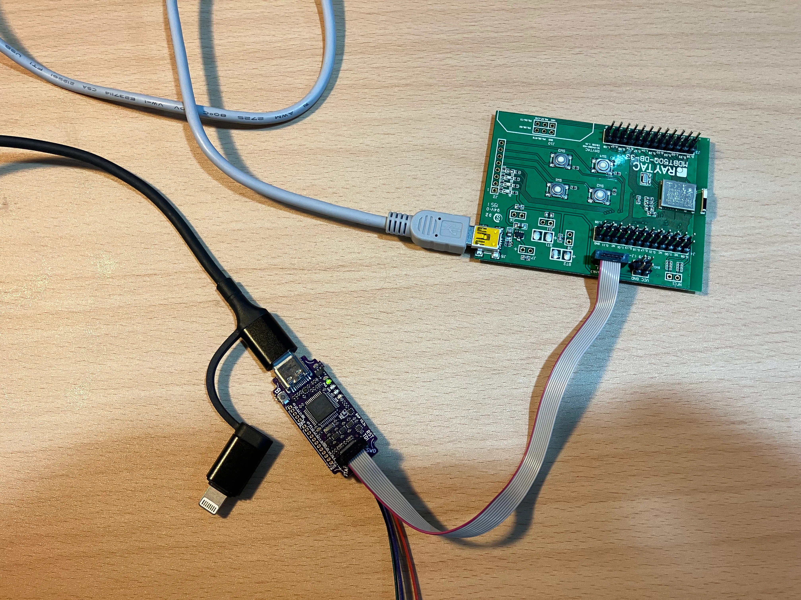
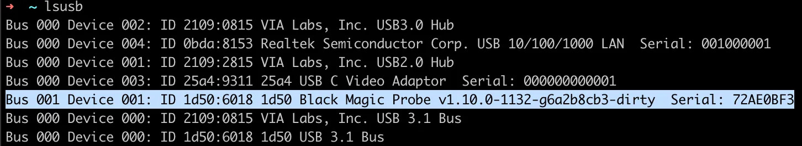
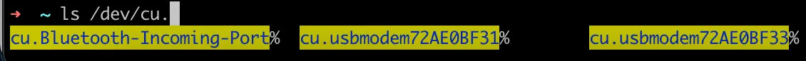
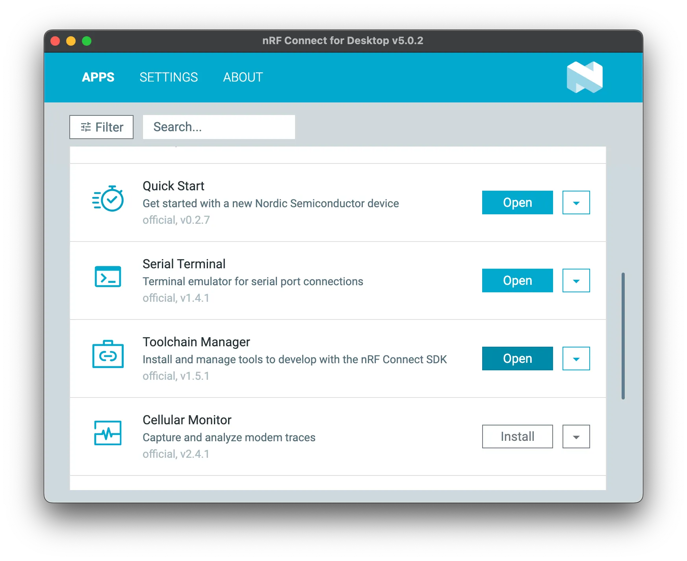
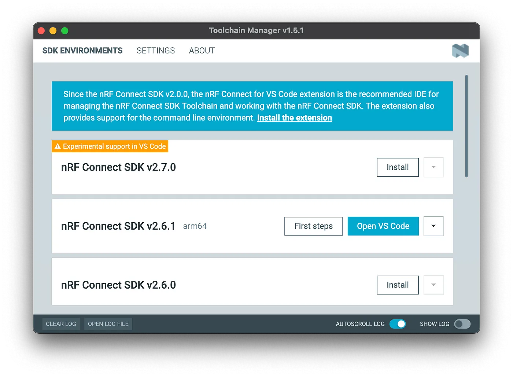
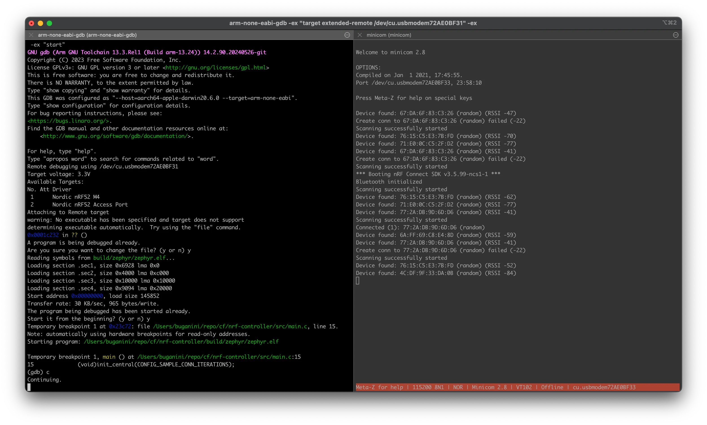

# Workflow for Zephyr-based project on nRF52 with Black Magic Probe
This article describes how to build a Zephyr project with the command line (not deviate from Nordic's official workflow) and program/debug with Black Magic Probe instead of using the Nordic's official VSCode extension and Segger J-Link tool. RTT (stdio runs on SWD) is also desired.

**Tool**: Black Magic Probe v2.3c native

It is called native because Black Magic Probe can also run on other 3rd party hardware, check https://black-magic.org/hardware.html for more details)

**Target Hardware**: Raytac MDBT50Q-DB-33 (nrf52833)
Black Magic Probe (BMP) is probably the most versatile debugger, check https://black-magic.org/supported-targets.html for more details

**My OS**: macOS Sonoma 14.6.1, Apple M2, everything should be no more difficult on Linux

I purchased the Black Magic Probe from https://www.mouser.tw/ProductDetail/392-BLACKMAGICPROV23
It is nice to also have https://www.mouser.tw/ProductDetail/485-2094 for different pinouts.

## Prerequisites (macOS)
```
brew install --cask gcc-arm-embedded
```

## Hardware Setup



Connect both the BMP, the USB power supply for MDBT50Q-DB-33, and the SWD cable between the two boards.

The definition of the 10Pins connector can be found at https://black-magic.org/knowledge/pinouts.html

The schematics for Raytac MDBT50Q-DB-33 can be found at https://www.raytac.com/product/ins.php?index_id=97

## Check BMP Connection



* cu.usbmodemxxxxxxxx1: GDB port
* cu.usbmodemxxxxxxxx3: RTT port

## Connect to BMP with GDB
```
> arm-none-eabi-gdb
...

(gdb) target extended-remote /dev/cu.usbmodem72AE0BF31
Remote debugging using /dev/cu.usbmodem72AE0BF31

(gdb) monitor help
General commands:
 version -- Display firmware version info
 help -- Display help for monitor commands
 jtag_scan -- Scan JTAG chain for devices
 swd_scan -- Scan SWD interface for devices: [TARGET_ID]
 swdp_scan -- Deprecated: use swd_scan instead
 auto_scan -- Automatically scan all chain types for devices
 frequency -- set minimum high and low times: [FREQ]
 targets -- Display list of available targets
 morse -- Display morse error message
 halt_timeout -- Timeout to wait until Cortex-M is halted: [TIMEOUT, default 2000ms]
 connect_rst -- Configure connect under reset: [enable|disable]
 reset -- Pulse the nRST line - disconnects target: [PULSE_LEN, default 0ms]
 tdi_low_reset -- Pulse nRST with TDI set low to attempt to wake certain targets up (eg LPC82x)
 tpwr -- Supplies power to the target: [enable|disable]
 traceswo -- Start trace capture, Manchester mode: [decode [CHANNEL_NR ...]]
 heapinfo -- Set semihosting heapinfo: HEAPINFO HEAP_BASE HEAP_LIMIT STACK_BASE STACK_LIMIT

(gdb) monitor swd_scan
Target voltage: 3.3V
Available Targets:
No. Att Driver
 1      Nordic nRF52 M4
 2      Nordic nRF52 Access Port

(gdb) attach 1
Attaching to Remote target
warning: No executable has been specified and target does not support
determining executable automatically.  Try using the "file" command.
0x0001c232 in ?? ()

(gdb) monitor rtt
Target does not support this command.
```

It appears that the firmware shipped with the BMP doesn't enable RTT, so we need to build the firmware.

## Firmware Upgrade for the Black Magic Probe
Prerequisites for macOS
```
brew install git meson ninja
# for building firmware

brew install dfu-util
# for firmware programming
# check https://black-magic.org/upgrade.html for other tools
```

Checkout and Configure
```
> git clone https://github.com/blackmagic-debug/blackmagic.git
> cd blackmagic

> meson setup build --cross-file cross-file/native.ini
...
Black Magic Debug 1.10.0

  Targets
    Cortex-A/R support       : NO
    Cortex-M support         : YES
    RISC-V 32-bit support    : NO
    RISC-V 64-bit support    : NO
    Arterytek parts          : NO
    CH579                    : NO
    Energy Micro parts       : YES
    HC32 parts               : YES
    LPC series parts         : YES
    nRF series parts         : YES
    Kinetis series parts     : YES
    Puya PY32 series parts   : NO
    Renesas parts            : YES
    RP2040                   : YES
    ATSAM series parts       : YES
    STM32 (and clones) parts : YES
    Texas Instruments parts  : YES
    Xilinx parts             : NO

  Probe
    Name                     : Black Magic Probe (native)
    Platform                 : STM32F1
    Bootloader               : Black Magic Debug Bootloader
    Load Address             : 0x8002000

  Black Magic Debug
    Debug output             : NO
    RTT support              : NO
    Advertise QStartNoAckMode: NO
    Building Firmware        : YES
    Building BMDA            : YES

  Subprojects
    hidapi                   : YES
    libftdi                  : YES
    libopencm3               : YES

  User defined options
    Cross files              : cross-file/native.ini
```

As you can see, RTT support is not enabled, so let's edit the build config
```
> vim cross-file/native.ini

> git diff
diff --git a/cross-file/native.ini b/cross-file/native.ini
index ef7194bc..b5635b63 100644
--- a/cross-file/native.ini
+++ b/cross-file/native.ini
@@ -19,6 +19,6 @@ endian = 'little'

 [project options]
 probe = 'native'
-targets = 'cortexm,efm,hc32,lpc,nrf,nxp,renesas,rp,sam,stm,ti'
-rtt_support = false
+targets = 'cortexm,nrf,nxp,renesas,rp,stm,ti'
+rtt_support = true
 bmd_bootloader = true
```

It is said that the flash size cannot accommodate all of the features, so I disabled targets that I may not use in the near future.

Then clean up and start over.
```
> rm -rf build
> meson setup build --cross-file cross-file/native.ini
...
Black Magic Debug 1.10.0

  Targets
    Cortex-A/R support       : NO
    Cortex-M support         : YES
    RISC-V 32-bit support    : NO
    RISC-V 64-bit support    : NO
    Arterytek parts          : NO
    CH579                    : NO
    Energy Micro parts       : NO
    HC32 parts               : NO
    LPC series parts         : NO
    nRF series parts         : YES
    Kinetis series parts     : YES
    Puya PY32 series parts   : NO
    Renesas parts            : YES
    RP2040                   : YES
    ATSAM series parts       : NO
    STM32 (and clones) parts : YES
    Texas Instruments parts  : YES
    Xilinx parts             : NO

  Probe
    Name                     : Black Magic Probe (native)
    Platform                 : STM32F1
    Bootloader               : Black Magic Debug Bootloader
    Load Address             : 0x8002000

  Black Magic Debug
    Debug output             : NO
    RTT support              : YES
    Advertise QStartNoAckMode: NO
    Building Firmware        : YES
    Building BMDA            : YES

  Subprojects
    hidapi                   : YES
    libftdi                  : YES
    libopencm3               : YES

  User defined options
    Cross files              : cross-file/native.ini
```

Looks good, let's continue building
```
> meson compile -C build
...
[421/543] Linking target blackmagic_native_firmware.elf
Memory region         Used Size  Region Size  %age Used
             rom:      108148 B       128 KB     82.51%
             ram:        9772 B        20 KB     47.71%
[543/543] Linking target blackmagic
```

If you see errors related to no "stdint.h" in arm-none-eabi-gcc, you probably didn't install the completed set of GCC: https://stackoverflow.com/questions/77249021/no-stdint-h-in-arm-none-eabi-gccmac

Finally, program the firmware
```
> sudo dfu-util -d 1d50:6018,:6017 -s 0x08002000:leave -D build/blackmagic_native_firmware.bin
Password:
dfu-util 0.11

Copyright 2005-2009 Weston Schmidt, Harald Welte and OpenMoko Inc.
Copyright 2010-2021 Tormod Volden and Stefan Schmidt
This program is Free Software and has ABSOLUTELY NO WARRANTY
Please report bugs to http://sourceforge.net/p/dfu-util/tickets/

dfu-util: Warning: Invalid DFU suffix signature
dfu-util: A valid DFU suffix will be required in a future dfu-util release
Opening DFU capable USB device...
Device ID 1d50:6018
Run-Time device DFU version 011a
Claiming USB DFU (Run-Time) Interface...
Setting Alternate Interface zero...
Determining device status...
DFU state(0) = appIDLE, status(0) = No error condition is present
Device really in Run-Time Mode, send DFU detach request...
Device will detach and reattach...
Opening DFU USB Device...
Claiming USB DFU Interface...
Setting Alternate Interface #0 ...
Determining device status...
DFU state(2) = dfuIDLE, status(0) = No error condition is present
DFU mode device DFU version 011a
Device returned transfer size 1024
DfuSe interface name: "Internal Flash   "
Downloading element to address = 0x08002000, size = 99956
Erase    [=========================] 100%        99956 bytes
Erase    done.
Download [=========================] 100%        99956 bytes
Download done.
File downloaded successfully
Submitting leave request...
Transitioning to dfuMANIFEST state
```

### References
* https://black-magic.org/usage/rtt.html#build-instructions
* https://github.com/blackmagic-debug/blackmagic/

## Back to GDB
This time we run gdb commands in one-liner style
```
>  arm-none-eabi-gdb -ex "target extended-remote /dev/cu.usbmodem72AE0BF31" -ex "monitor swd_scan" -ex "attach 1"
(gdb) monitor help
General commands:
 version -- Display firmware version info
 help -- Display help for monitor commands
 jtag_scan -- Scan JTAG chain for devices
 swd_scan -- Scan SWD interface for devices: [TARGET_ID]
 swdp_scan -- Deprecated: use swd_scan instead
 auto_scan -- Automatically scan all chain types for devices
 frequency -- set minimum high and low times: [FREQ]
 targets -- Display list of available targets
 morse -- Display morse error message
 halt_timeout -- Timeout to wait until Cortex-M is halted: [TIMEOUT, default 2000ms]
 connect_rst -- Configure connect under reset: [enable|disable]
 reset -- Pulse the nRST line - disconnects target: [PULSE_LEN, default 0ms]
 tdi_low_reset -- Pulse nRST with TDI set low to attempt to wake certain targets up (eg LPC82x)
 tpwr -- Supplies power to the target: [enable|disable]
 rtt -- [enable|disable|status|channel [0..15 ...]|ident [STR]|cblock|ram [RAM_START RAM_END]|poll [MAXMS MINMS MAXERR]]
 traceswo -- Start trace capture, Manchester mode: [decode [CHANNEL_NR ...]]
 heapinfo -- Set semihosting heapinfo: HEAP_BASE HEAP_LIMIT STACK_BASE STACK_LIMIT
Target specific commands:
 erase_mass -- Erase whole device Flash
 erase_range -- Erase a range of memory on a device
 redirect_stdout -- Redirect semihosting output to aux USB serial
ARM Cortex-M specific commands:
 vector_catch -- Catch exception vectors
nRF52 specific commands:
 erase_uicr -- Erase UICR registers
 protect_flash -- Enable flash read/write protection
 read -- Read device parameters
```

Now we have RTT support.

## Building Zephyr Project
First, make sure you have nRF Connect SDK installed.
I use the Toolchain Manager from nrf Connect for Desktop




```
> export ZEPHYR_BASE=/opt/nordic/ncs/v2.6.1/zephyr
> export NCS_TOOLCHAIN=/opt/nordic/ncs/toolchains/580e4ef81c
> export PATH=$NCS_TOOLCHAIN/bin:$PATH
# building process uses the cmake modules in the toolchain so let's just set the PATH

> west build \
 -b your_board \
 --build-dir your_build_dir \
 --no-sysbuild \
 your_project_dir \
 -- \
 -DBOARD_ROOT=your_board_root \
 -DCONF_FILE=your_project_dir/prj.conf

# your_build_dir is typically just your_project_dir/build
# your_board_root is the folder contains boards/arm/your_board if you use customized board
```

Programming Firmware
```
> arm-none-eabi-gdb \
 -ex "target extended-remote /dev/cu.usbmodem72AE0BF31" \
 -ex "monitor swd_scan" \
 -ex "attach 1" \
 -ex "monitor rtt enable" \
 -ex "file build/zephyr/zephyr.elf" \
 -ex "load" \
 -ex "run"

...
Are you sure you want to change the file? (y or n) y
Reading symbols from build/zephyr/zephyr.elf...
Loading section rom_start, size 0x100 lma 0x0
Loading section text, size 0x1b258 lma 0x100
Loading section .ARM.exidx, size 0x8 lma 0x1b358
Loading section initlevel, size 0x88 lma 0x1b360
Loading section device_area, size 0x3c lma 0x1b3e8
Loading section sw_isr_table, size 0x180 lma 0x1b424
Loading section bt_l2cap_fixed_chan_area, size 0x24 lma 0x1b5a4
Loading section bt_gatt_service_static_area, size 0x10 lma 0x1b5c8
Loading section rodata, size 0xc74 lma 0x1b5d8
Loading section datas, size 0x788 lma 0x1c24c
Loading section device_states, size 0x6 lma 0x1c9d4
Loading section k_mem_slab_area, size 0x54 lma 0x1c9dc
Loading section k_mutex_area, size 0x14 lma 0x1ca30
Loading section k_fifo_area, size 0x30 lma 0x1ca44
Loading section net_buf_pool_area, size 0x108 lma 0x1ca74
Loading section .last_section, size 0x4 lma 0x1cb7c
Start address 0x0000fccc, load size 117630
Transfer rate: 30 KB/sec, 884 bytes/write.
The program being debugged has been started already.
Start it from the beginning? (y or n) y
Starting program: /path/to/project/build/zephyr/zephyr.elf
```

If you have a multi-images build (e.g. having CONFIG_BOOTLOADER_MCUBOOT=y in your prj.conf), you will need to program the merged.hex instead of zephyr.elf, but still use the zephyr.elf for debug symbols.
```
> arm-none-eabi-gdb \
 -ex "target extended-remote /dev/cu.usbmodem72AE0BF31" \
 -ex "monitor swd_scan" \
 -ex "attach 1" \
 -ex "monitor rtt enable" \
 -ex "file build/zephyr/zephyr.elf" \
 -ex "load build/zephyr/merged.hex" \
 -ex "run"
```

## RTT IO
You need to have these lines in your prj.conf
```
CONFIG_CONSOLE=y
CONFIG_RTT_CONSOLE=y
CONFIG_USE_SEGGER_RTT=y
```

After rebuild/program you should see the output from the RTT port
```
minicom -c on -D /dev/tty.usbmodem72AE0BF33
# -c on is for colorful output
```



## More Tips
\n -> \r\n translation in minicom
https://unix.stackexchange.com/questions/283924/how-can-minicom-permanently-translate-incoming-newline-n-to-crlf
